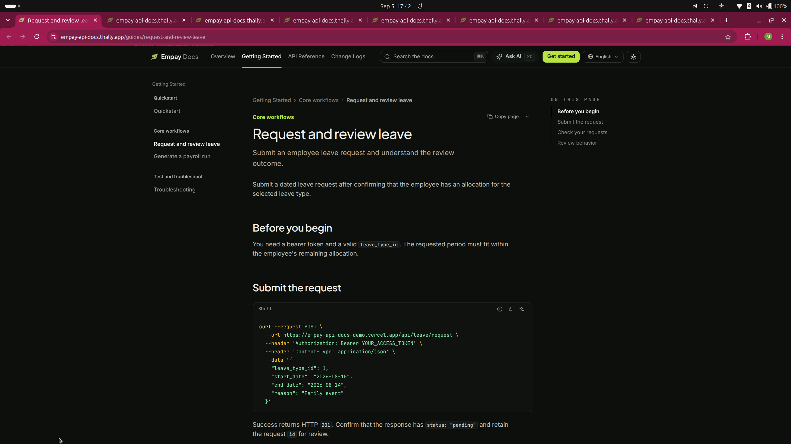
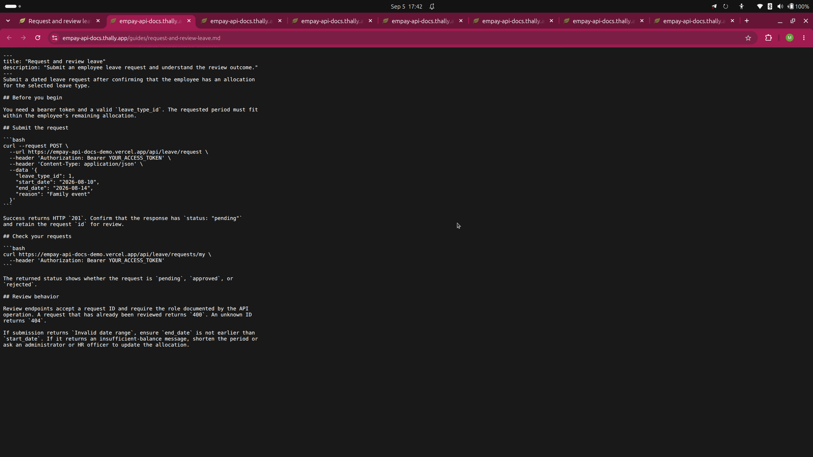
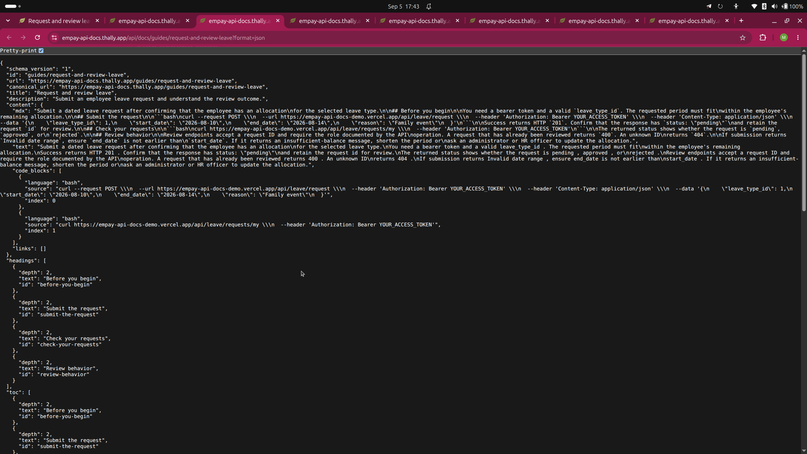
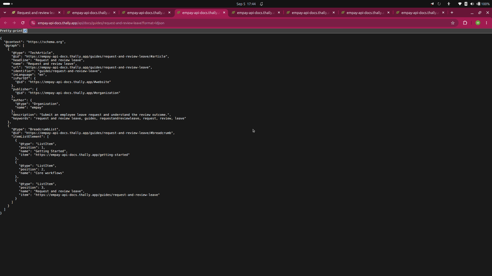
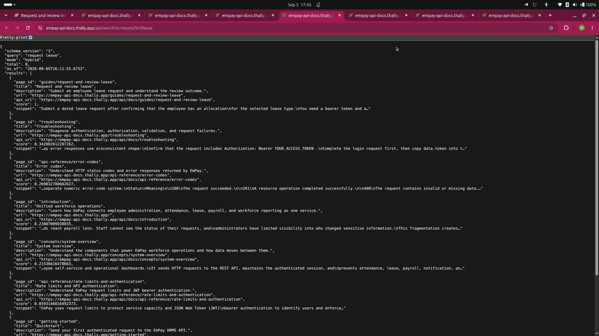
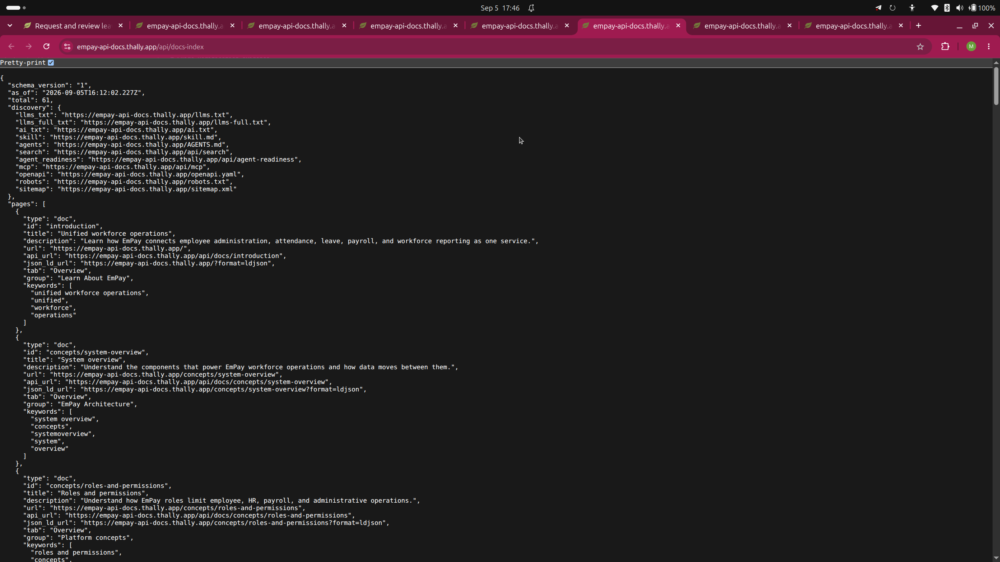
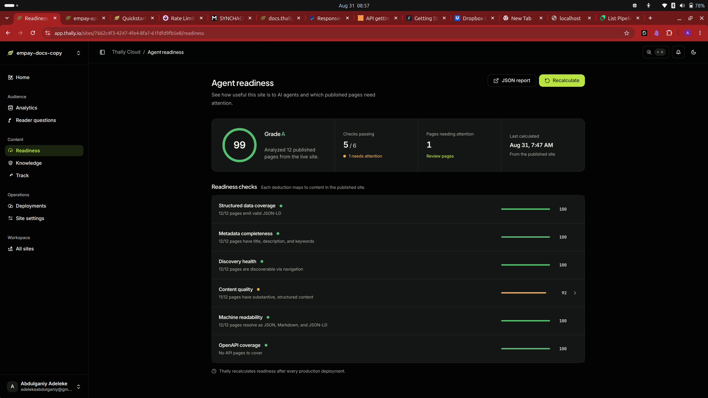
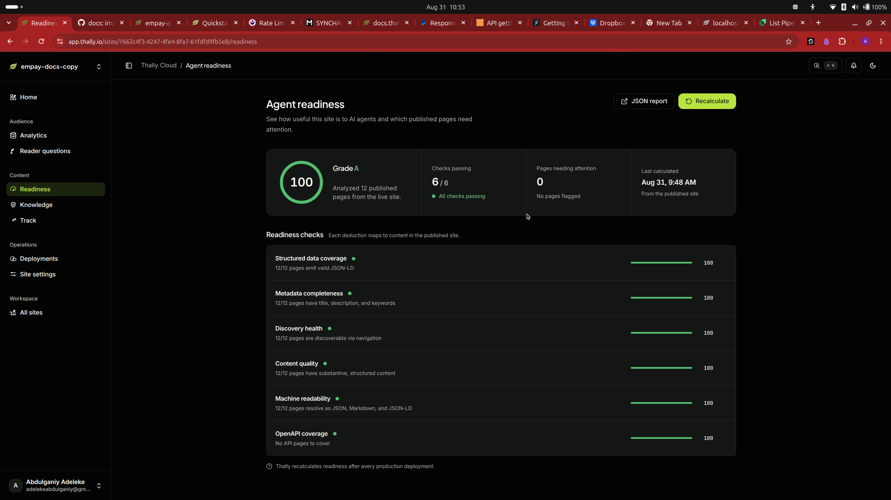

# EmPay HRMS docs | Track 2 evidence

This project meets Track 2's required documentation shape and demonstrates a
reviewed improvement from 99 to 100 in Agent Readiness, plus cross-surface
verification of a meaningful guide.

##  EmPay HRMS documentation

An agent-ready developer documentation site for the EmPay HRMS REST API.

- 12 substantive pages with clear navigation
- Quickstart, task guides, troubleshooting, and changelog
- 49-operation OpenAPI reference
- Published at `empay-api-docs.thally.app`

## The developer workflow

The site helps a developer understand the product, complete a real workflow,
and recover when something goes wrong.

## One guide, seven machine and human surfaces

The published “Request and review leave” guide was verified on September 5,
2026 across HTML, Markdown, JSON, JSON-LD, search, the agent index, and MCP.

Evidence: `evidence/guide-verification.md`

Screenshots:HTML ,Markdown , JSON ,
JSON-LD ,Search ,Agent index , and


##  Agent Readiness: before

The initial published site scored **99/100 (A)** across 12 pages.

- 5 of 6 checks passed
- Content quality: 92% (11/12 pages)
- Finding: `/changelog` had no content heading

Evidence: 

##  Reviewed improvement

Thally identified the changelog finding. After review, the author added
`## Documentation updates` above the release entries, preserving their meaning.

## 6. Agent Readiness: after

The revised published site scored **100/100 (A)**.

- 6 of 6 checks passed
- Content quality: 100%
- Pages needing attention: 0

Evidence: 

## Reproducible submission

The repository includes the content, navigation, OpenAPI contract, and runtime
configuration needed to reproduce the site.

Validation commands:

```bash
npm ci
npm ci --ignore-scripts --prefix .github/thally-tooling
.github/thally-tooling/node_modules/.bin/thally check --ci .
npm test
npm run build
```

Verified from a clean clone at commit `923c5f6`: install, check, 351 tests, and
production build all passed.

Evidence: [evidence link](evidence/clean-clone-verification.md)
